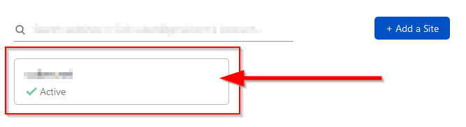
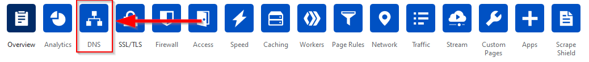
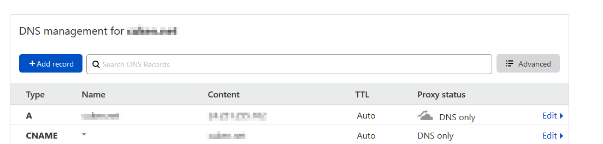
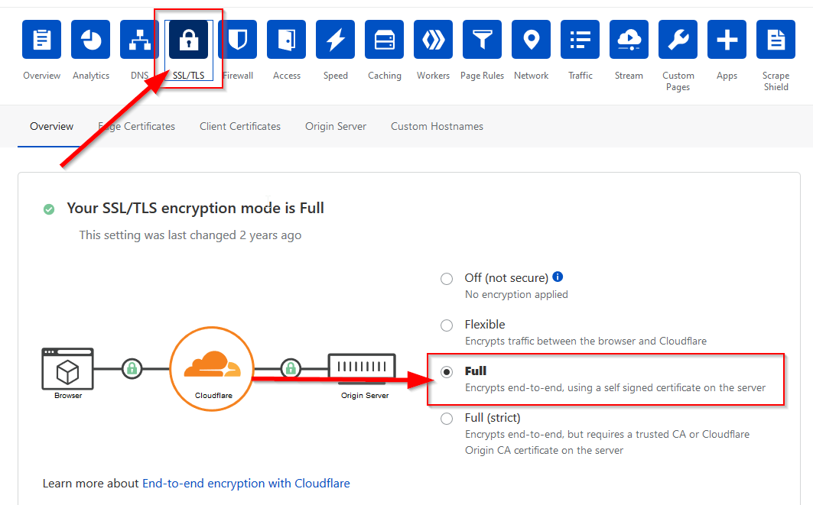
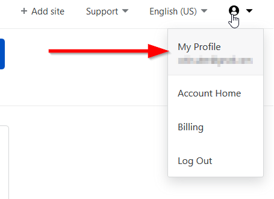
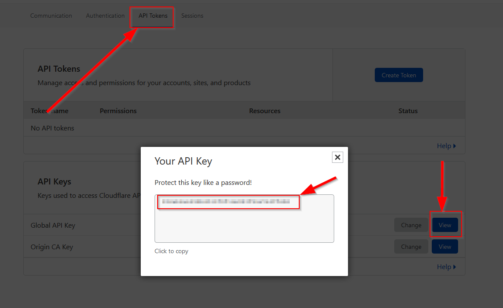

# Mining Node Setup Guide

This guide assumes you are running Ubuntu or a similar flavor of Linux.

Before you begin, make sure you have an active account on whatever Volition network you plan to join and have the genesis block for that network. When you start mining, you will need someone to upgrade your regular account to a mining account.

Commands listed in blocks shown below should be run on the server hosting the volition mining node:

```
example
```

## Provision Your Volition Account

If you don't already have one, or if you want to use a different account for mining, provision a new Volition account and rename it to whatever you want to use as your miner name. Volition will eventually support renaming mining accounts, but for beta it does not, so be sure your account is named what you want it to be.

## Stack Description

Currently the docker-compose stack consists of:

- Socket-Proxy (secure docker.sock to internal requests only)
- Traefik2 (as reverse proxy)
- Dozzle (Container logs vieweable over https)
- Glances (HTop over https)
- Watchtower (automatically update docker containers)
- Volition (volition node miner)
- CloudFlare DDNS (Updates CloudFlare with your most recent public IP) [`only needed if your server does not have a static ip`]

We use [traefik](https://traefik.io) as a reverse proxy to route requests into your volition mining node. Traefik will create subdomains per our docker containers and use LetsEncrypt to issue our SSL certificates. To validate domain owenrship, we'll use LetsEcnrypts CloudFlare DNS challenge.

## Prereqs

- A domain name
- Genesis block for the volition miner
- Port 443 open on the server used to host the mining node

### Set Up CloudFlare

First, if you do not already have a [CloudFlare](https://www.cloudflare.com/) account, create one and log in.

If you are creating a new CloudFlare account, you can choose their "free" plan (which may be listed below the paid plans on their welcome screen; look for it).

Once logged in, add your domain to CloudFlare for DNS management. Cloudflare will instruct you to change your domain name servers, follow the instructions provided by CloudFlare. You can choose the default settings; the main thing right now is to update your domain account (with your registrar) to use CloudFlare's nameservers and wait for the changes to go thourgh. This could take up to 24 hours. Once this is done, we can modify the DNS settings.

Once the domain has been added to CloudFlare, we need to change some settings.

Click on the domain name to open its settings.



Click on the DNS options button.



Make the following changes:

* Verify the A record IP is set correctly
* Change the root domain records Proxy status to DNS only (by clicking 'edit' and then the orange cloud icon; it should turn gray)
* Add a new CNAME record
  * Name: *
  * Target: your domain name
  * TTL: Auto
  * Proxy status: DNS Only
* Make sure your domain host is using the Cloudflare nameservers shown below
  
Your settings should look similiar to this:



Once done, click on the SSL/TLS button at the top. Make sure you have SSL/TLS encryption mode set to full.



> **If your server does not have a static IP, follow the next step**

To update CloudFlare with our public IP, we'll need our CloudFlare Global API key.

Click on your account icon on the top right of the screen and click My Profile.



Click on API Tokens -> Global Api Key -> View, and copy the Global API Key, we'll use it later to set up our DDNS service.



## Prepare Your Server

```
sudo apt update
```
```
sudo apt install curl docker docker-compose git openssl vim
```

## Clone this repo to your server

Clone this repo to your server by doing:

```
git clone https://github.com/cryptogogue/vol-node-setup.git
```

## Docker Setup

We'll create two networks to serve both the reverse proxy, and secure docker.sock container. 

Run the following commands:

```
docker network create --gateway 192.168.90.1 --subnet 192.168.90.0/24 t2_proxy
```
```
docker network create --gateway 192.168.91.1 --subnet 192.168.91.0/24 socket_proxy
```

Find a spot on your server where you'd like the docker container data to persist. In my server setup I set it to `/mnt/data/docker` but you can use whatever you want. We'll use the notation `$DOCKERDIR` to show the relative path to wherever you want to store your docker volumes.

You can set an environment variable DOCKERDIR to make these commands copy pasteable:
```
export DOCKERDIR=/mnt/data/docker
```

### Create your docker data directory

> **Run these commands from the root of this repository**

Create the required folders for the docker volition stack.

```
mkdir -p $DOCKERDIR/{traefik2/{acme,rules},volition}
```

Create and set permissions for the acme.json file which will store the certificate information.

```
touch $DOCKERDIR/traefik2/acme/acme.json
```

```
chmod 600 $DOCKERDIR/traefik2/acme/acme.json
```

Create the traefik log file

```
touch $DOCKERDIR/traefik2/traefik.log
```

Copy the rule files into the traefik2/rules directory.

```
cp traefik2/rules/* $DOCKERDIR/traefik2/rules/
```

Copy the enviornment file into the docker data directory

```
cp .env.example $DOCKERDIR/.env
```

Edit the .env file with your information. If you do not have a static IP, see above to get your CloudFlare global API key. To get the correct value for TZ (for example, TZ="America/Vancouver"), check https://en.wikipedia.org/wiki/List_of_tz_database_time_zones.

Copy the docker-compose.yml into the docker data directory

```
cp docker-compose.yml $DOCKERDIR/docker-compose.yml
```

**If your server does not have a static IP Follow the DDNS Setup Instructions.**

### DDNS Setup

If you do not have a static IP, you need to update CloudFlare with your most recent public IP. To avoid doing this manually, there is a container that will use the API key we retrieved earlier to update your domain names new IP address.

Uncomment out the following lines from the docker-compose file.

```
  cloudflare-ddns:
    container_name: cloudflare-ddns
    image: oznu/cloudflare-ddns:latest
    restart: unless-stopped
    environment:
      - EMAIL=$CLOUDFLARE_EMAIL
      - API_KEY=$CLOUDFLARE_API_KEY
      - ZONE=cuken.net
      - PROXIED=false
```

### Set Up the Volition Docker Directory

The example docker-compose files map `$DOCKERDIR/volition` onto /var/lib/volition/ inside the Docker container. This folder should be configured to contain the genesis block, the volition.ini file and the mining keys.

Copy and rename the example volition.ini:

```
cp volition.ini.example $DOCKERDIR/volition/volition.ini
```

Edit volition.ini by adding the name of the account you plan to use for mining:

```
control-key                 = /var/lib/volition/keys/control.pub.pem
control-level               = config
genesis                     = /var/lib/volition/genesis.json
keyfile                     = /var/lib/volition/keys/mining.priv.pem
openSSL.client.caConfig     = /etc/ssl/certs
persist                     = /var/lib/volition/persist-chain
port                        = 9090

miner                       = <your miner account name>
```

Generate the mining keys with the helper script:

```
./make-keys.sh $DOCKERDIR/volition/keys
```

The keys will be placed in $DOCKERDIR/volition/keys. After running the script, you should have two sets of .pem files: one for mining and one for mining node control.

Finally, use curl to fetch the genesis block:

```
curl <URL of genesis block> -o $DOCKERDIR/volition/genesis.json
```

For example, the open beta genesis block is located at https://raw.githubusercontent.com/cryptogogue/vol-blocks/main/open-beta.json.

## Starting the Node

Docker-compose will manage the container state, and rebuild the images as needed.

```
cd $DOCKERDIR
docker-compose up -d
```

Each service will be mounted at a subdomain. So if your domain name is "bulbousbouffant.com", you would find Dozzle at "dozzle.bulbousbouffant.com":

https://dozzle.bulbousbouffant.com
https://volition.bulbousbouffant.com
https://traefik.bulbousbouffant.com

It may take a little while for your CloudFlare to provision your SSL certificates, so if you don't see the services appear right away, try back in five or ten minutes.

## Updating the Node

The included stack uses watchtower to automatically update images for your docker container. At `12:30 AM` local time, watchtower will do a check against the docker-hub registry and pull any needed updates.

If you want to force an update you can do the following:

```
cd $DOCKERDIR
docker-compose pull
docker-compose up -d
```

## Upgrade Your Account

Once your node is connected to the network, you are ready to upgrade your account and start mining.

At the time of this writing, self-serve mining accounts aren't supported. Those will entail obtaining a verified digital identity from a third party.

To upgrade your account, ask someone with an administrator account to help you. You will need to send them the URL of your mining node.

If you don't need to send miner control commands, you are done and can take a break.

# Submit Feedback / Bugs

If you run into any issues while setting up the node, or if something stops workings; please let us know on Discord, or open an issue on this repo.

**Happy mining!**
